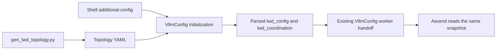

# LWD configuration migration

## Scope

This migration only generates, parses, validates and forwards configuration.
It does not enable edge/cloud model execution, create HCCL/ZMQ connections,
change native parallel settings, select a scheduler, start HTTP coordination,
read tenant keys or select physical NPUs. Launch logs explicitly say
`metadata_only=True`; this is not a successful distributed-inference launch.

The schema keeps five sections: `deployment`, `feature_ctrl`, `edges`, `clouds`
and `instance_links`. No `rendezvous` or `lwd_runtime` section is introduced.
The original runtime's default store endpoint is outside this migration.

## Configuration flow



`lwd_config` accepts only `path`, `role` and integer `instance_id`. vLLM parses
the YAML into `VllmConfig.lwd_config`, preserving the source configuration flow.
Worker transport carries that snapshot; Ascend does not open a second YAML.
The two LWD namespaces remain in `additional_config` but are excluded from
Ascend's platform-specific keyword validation. Other unknown platform keys
still fail validation.

## Generator input

Keep `--edge-machines`; accept either a comma-separated list of IP addresses
or a list of `ID@IP` entries. Do not mix the two forms. Explicit IDs must be
unique and contiguous from zero; entries are normalized by ID. Physical NPU
numbers appear only in each launch script's `ASCEND_RT_VISIBLE_DEVICES`.

| Scene | Edge placement | Instance links |
| --- | --- | --- |
| `single_instance` | One edge instance | E0 to C0 |
| `edge_share` | Colocated instances sharing one edge rank | Ei to Ci |
| `cloud_share` | Independent rank per edge instance, even on the same host | Every edge to C0 |
| `lwd_cluster` | Independent rank per edge instance | Every edge to every cloud |

Pure addresses preserve the original instance allocation, including creating
one edge instance per cloud in `edge_share`. Explicit IDs make colocated
independent instances possible. Scene validation uses logical instances and
links rather than counting distinct edge IPs.

Every edge instance's DPs share its one rank. Every cloud machine has eight
ranks, split evenly over DP. `--dp` accepts one integer (1, 2, 4 or 8) and
produces one YAML; this migration's fixture/regression matrix covers 1 and 2.
`--dp 1,2` is deliberately no longer accepted. Linked DPs match by `dp_idx`.
Ports are `port_base + dp_idx`, unique per cloud address; different cloud
machines may reuse the same port number.

Example: two independent edge instances on one physical host, DP=2:

```bash
python tools/gen_lwd_topology.py \
    --scene cloud_share \
    --edge-machines '0@76.76.26.17,1@76.76.26.17' \
    --cloud-machines 76.76.26.232 \
    --dp 2 --port-base 15783 \
    -o etc/lwd/2e1c/topology_2dp.yaml
```

For separate edge hosts, change only the input to
`--edge-machines '0@76.76.26.17,1@76.76.26.18'`.
For the original pure-address form use `--edge-machines 76.76.26.17,76.76.26.18`.
Colocated E0/E1 still own ranks 0/1; cloud ranks are 2 through 9. DP=2 divides
cloud ranks into `[2,3,4,5]` and `[6,7,8,9]` without increasing world size.

## Coordination settings

Keep `lwd_coordination` beside `lwd_config` in `--additional-config`. Fields
used by the supplied launch examples are `enabled`, `control_url`,
`tenant_key_file`, `consumer_id`, `listen_host`, `listen_port`, `instance_id`
and `connect_timeout`. The coordination string ID is separate from the numeric
topology ID. Enabled edge coordination requires a URL and local key-file path.
Only syntax/types are checked; the key is not opened and no endpoint is contacted.
Values are forwarded without applying the reference runtime's timeout clamp.
Reserved fields with no launch-example use are not added.

## Verification

Run device-independent checks in the uv-managed development environment:

```bash
.venv/bin/python -m pytest --confcutdir=tests/config/lwd tests/config/lwd -q
.venv/bin/python tools/lwd/check_config.py --additional-config \
  '{"lwd_config":{"path":"etc/lwd/2e1c/topology_2dp.yaml","role":"edge","instance_id":1}}'
```

Tests and purposes for human review:

- Original eight YAML fixtures: preserve ranks, links and DP expansion.
- Colocated edges at DP=1/2: independent edge ranks without allocating extra DP ranks.
- Invalid IDs, ranks, missing links, duplicate YAML keys and colliding ports:
  fail during configuration rather than runtime initialization.
- Legacy generator commands: reproduce the original eight YAML payloads.
- Explicit colocated IDs: deterministic ranks and per-DP ports.
- Invalid generator input: preserve an existing output file.
- Snapshot serialization: retain all selected-instance metadata after the source
  YAML is removed, without reading tenant keys or opening sockets.
- No LWD settings: produce no LWD snapshot and preserve the centralized path.
- Invalid coordination settings: reject malformed values before handoff.
- Ascend regression: preserve upstream LWD metadata without treating it as an
  Ascend hardware option; requires the full Ascend unit-test environment.

After deploying the changes from both repositories to a server, use the original centralized launch
and a short inference request for regression. Adding LWD metadata only verifies
parsing/logging; it must not change native TP/DP/world values or establish LWD
connections. This local environment does not have torch, transformers or an NPU,
so full VllmConfig/worker and centralized inference validation remain on-server.

## Provenance and migration boundaries

The configuration source is GitCode qxxxw/vllm PR #42, paired with
qxxxw/vllm-ascend PR #68, source branch `prefill_only_newsetting`:

1. `80862db`: YAML entry and initial schema.
2. `3ce3963`: configuration inspection logs.
3. `a47d548`: multiple-instance topology.
4. `c269514`: control-endpoint schema refinements only; no transport code.
5. `73fdb94`: generator.
6. `2c14950`: schema validation and eight layouts.
7. `7db0421`: cloud-reuse validation.
8. `26d8980`: final PR #42 configuration snapshot.

PR #68 snapshot `0d9b479` consumes the parsed vLLM topology; no data-plane
implementation from that snapshot is migrated here. Coordination fields are
based on the cloud-reuse branch snapshot `ca02565` and the supplied Desktop
2E1C scripts. This is a configuration extraction, not a whole-PR cherry-pick.
Source history is unchanged; the destination commits separate schema,
generator, configuration handoff and examples. The Ascend handoff compatibility
change is a separate cross-repository commit.

Intent comments requiring human review explain: independent instance ranks on
one host; shared ranks within an edge instance; parsing the YAML once without
parallel projection; excluding upstream-owned keys only from Ascend validation; allowing pickle
only in the trusted snapshot round-trip test (no external payloads).
